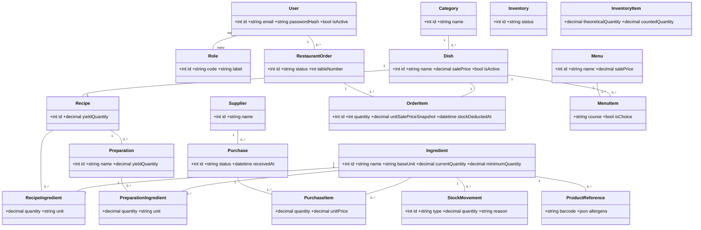

# Diagramme de classes

```mermaid
classDiagram
class User {+int id +string email +string passwordHash +bool isActive}
class Role {+int id +string code +string label}
class Category {+int id +string name}
class Dish {+int id +string name +decimal salePrice +bool isActive}
class Ingredient {+int id +string name +string baseUnit +decimal currentQuantity +decimal minimumQuantity}
class Recipe {+int id +decimal yieldQuantity}
class RecipeIngredient {+decimal quantity +string unit}
class Preparation {+int id +string name +decimal yieldQuantity}
class PreparationIngredient {+decimal quantity +string unit}
class Supplier {+int id +string name}
class Purchase {+int id +string status +datetime receivedAt}
class PurchaseItem {+decimal quantity +decimal unitPrice}
class StockMovement {+int id +string type +decimal quantity +string reason}
class Inventory {+int id +string status}
class InventoryItem {+decimal theoreticalQuantity +decimal countedQuantity}
class RestaurantOrder {+int id +string status +int tableNumber}
class OrderItem {+int id +int quantity +decimal unitSalePriceSnapshot +datetime stockDeductedAt}
class Menu {+int id +string name +decimal salePrice}
class MenuItem {+string course +bool isChoice}
class ProductReference {+string barcode +json allergens}

User "many" -- "many" Role
Category "1" -- "0..*" Dish
Dish "1" -- "1" Recipe
Recipe "1" -- "0..*" RecipeIngredient
Ingredient "1" -- "0..*" RecipeIngredient
Recipe "1" -- "0..*" Preparation
Preparation "1" -- "0..*" PreparationIngredient
Ingredient "1" -- "0..*" PreparationIngredient
Supplier "1" -- "0..*" Purchase
Purchase "1" -- "1..*" PurchaseItem
Ingredient "1" -- "0..*" PurchaseItem
Ingredient "1" -- "0..*" StockMovement
User "1" -- "0..*" RestaurantOrder
RestaurantOrder "1" -- "1..*" OrderItem
Dish "1" -- "0..*" OrderItem
Menu "1" -- "1..*" MenuItem
Dish "1" -- "0..*" MenuItem
Ingredient "1" -- "0..*" ProductReference
```
